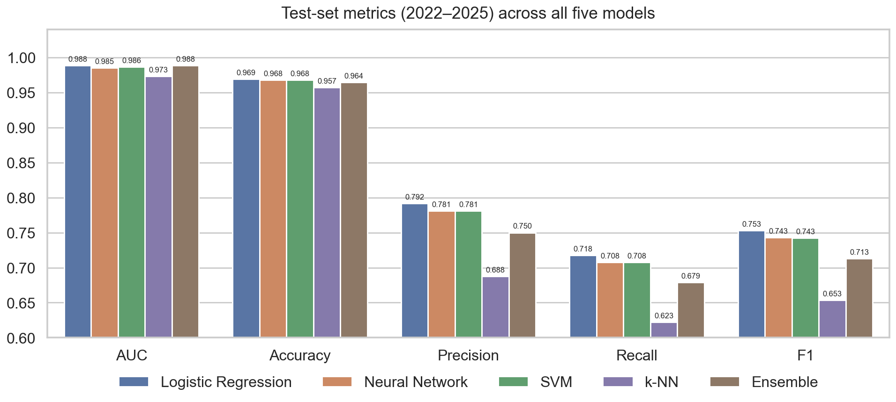
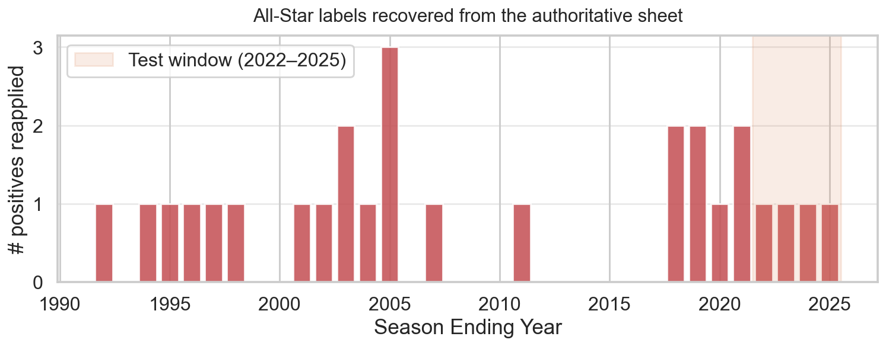
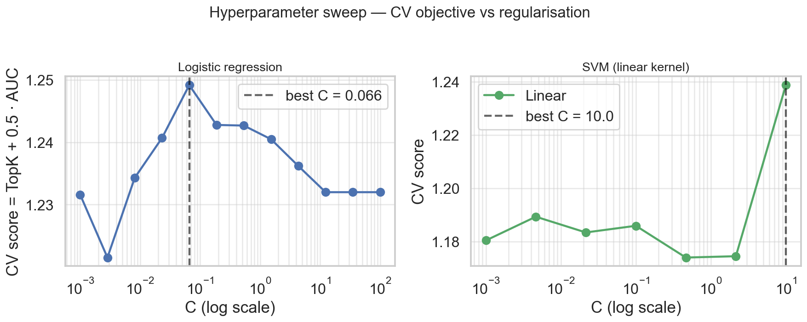
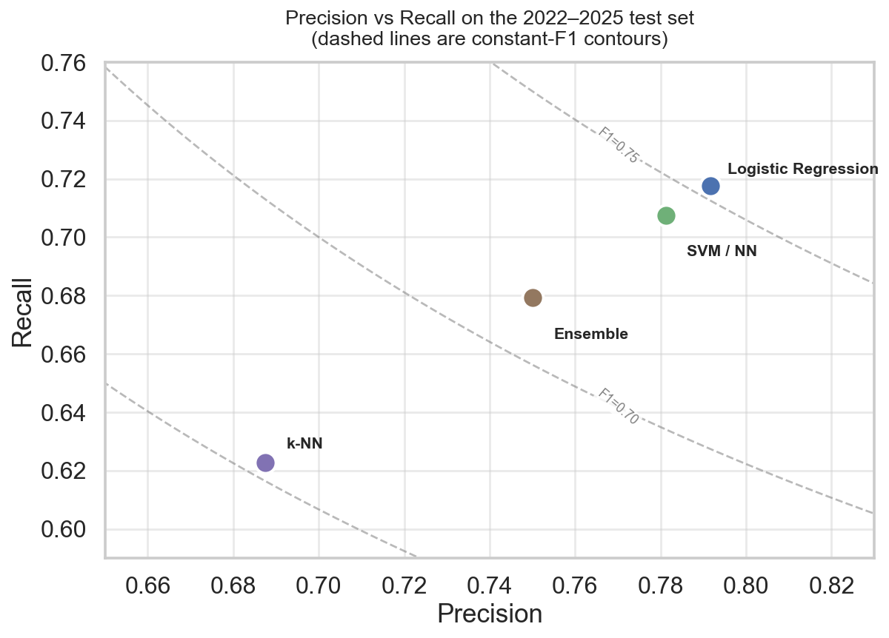
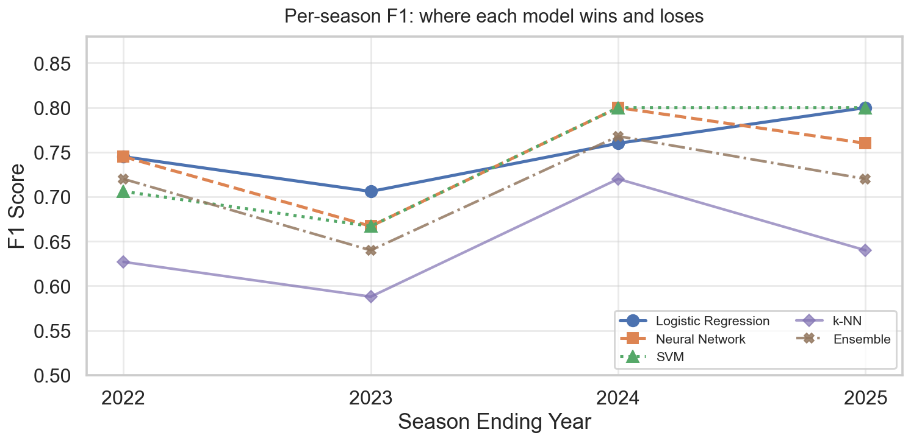
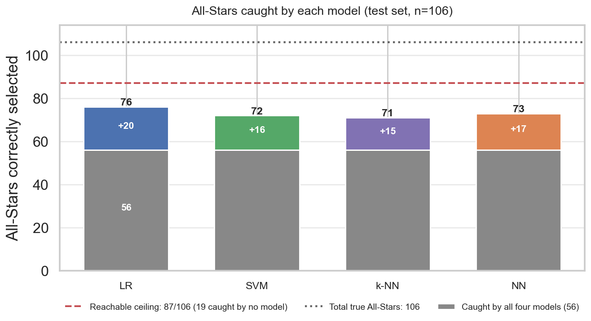
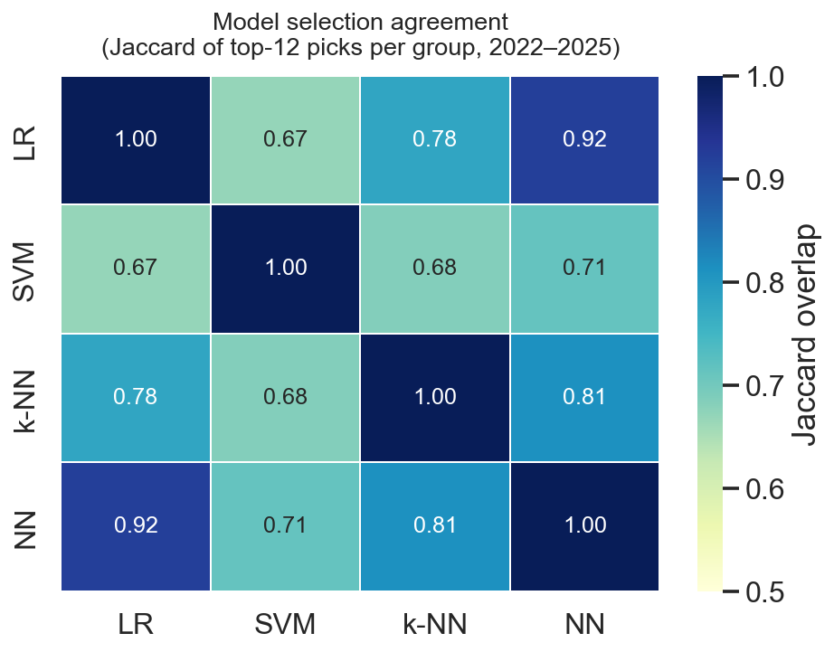

# NBA All-Star Prediction

Picking the 24 All-Stars at the end of an NBA season looks like a classification problem, but it really isn't. Twelve players make each conference roster, and the math is unforgiving:

> *Top-2 backcourt + top-3 frontcourt as starters, plus 7 reserves, **per conference, per year**.*

So the question I actually care about is **not** "is this player an All-Star?" — it's **"how does this player rank inside his competitive pool?"** Everything in this repo is built around that distinction.



---

## What this repo does

- A leakage-free preprocessing pipeline that normalizes within each NBA season and reapplies the All-Star labels from an authoritative Wikipedia-derived list (more on that below — there was a real data bug there).
- **Five** competing models on the same data:
  - **Logistic regression** with a hybrid pointwise + pairwise blend,
  - **Neural network** with self-attention over each `(season, conference)` group and starter/reserve heads,
  - **Support vector machine** with rolling-window CV across multiple architectures,
  - **k-Nearest Neighbours**, per-conference, with a tunable distance-weighting kernel,
  - **Ensemble** of all four base models with three blend strategies (val-tuned weights, equal weights, within-group Borda rank).
- Structured top-K selection at inference so the model is forced to commit to a 12-player roster per conference, the way the real ballot does.
- Per-season + global evaluation that calls out *where* each model is winning and losing, not just the average.

If you only read one number from this README: **logistic regression wins on F1 (0.7527)**. NN and SVM tie at 0.7426. k-NN is the weakest base learner at 0.6535. The ensemble doesn't beat the best single model on this data — more on why below.

---

## The problem, formally

For each `(season s, conference c)` group $G_{s,c}$, learn a scoring function

$$f(x_i) \rightarrow \mathbb{R}$$

and select

$$\text{TopK}(f(x_i)) \quad \text{subject to roster constraints.}$$

The structured-selection step is what gives this project its character. Without it, AUC is excellent (~0.985) but the model can hand back well-ordered probabilities and *still* miss roster slots — because a hard threshold doesn't know that East and West each get exactly 12 picks with positional quotas.

---

## Preprocessing: five things I cared about

Most of the work is here. Below are the five invariants the pipeline is built around — each came out of a bug I hit while iterating.

### 1. Franchise identity normalization

Teams move. Seattle becomes OKC, New Jersey becomes Brooklyn, Vancouver becomes Memphis, Charlotte exists, doesn't, then exists again. If you group by raw team string, your 2008 Seattle row and your 2009 OKC row sit in different buckets even though it's literally the same franchise. So I built a canonical `franchise → code` map and derive conference deterministically from there.

### 2. Structural missingness, before imputation

A NaN in 3P% with 0 3PA isn't missing data — it's a zero denominator. If you let KNN imputation see those NaNs, it'll happily invent values, which is poison for a season-relative model. I zero those out *before* anything else touches the data.

$$
\text{3P\%} =
\begin{cases}
0 & \text{if 3PA} = 0 \\
\text{observed} & \text{otherwise}
\end{cases}
$$

### 3. Season-local imputation and normalization

Eras play different basketball. 1996 plodded; 2019 ran a sprint. If you impute or z-score globally, you drag old players toward the modern mean and the relative-performance signal — the thing the model actually needs — gets distorted.

For each season $s$:

1. Standardize features: $X_s \rightarrow \tilde{X}_s$
2. Apply KNN imputation in standardized space: $\tilde{X}_s^{\text{imputed}} = \text{KNN}(\tilde{X}_s)$
3. Inverse-transform: $X_s^{\text{final}} = \sigma_s \tilde{X}_s^{\text{imputed}} + \mu_s$

Then z-score within season:

$$x' = \frac{x - \mu_s}{\sigma_s}$$

This preserves **relative standing** while erasing era-level pace and scoring inflation.

### 4. Authoritative All-Star labels (the data bug)

This one took an embarrassing amount of debugging. The main "compiled data set" sheet in the source workbook was **missing 28 All-Star labels**, almost all of them players whose names lost their diacritics somewhere during ingest:

- Nikola Jokić (2019, 2020, 2021, 2022, 2023, 2024, 2025) — *the league MVP, mislabelled as a non-All-Star seven times in a row*
- Kristaps Porziņģis (2018)
- Goran Dragić (2018)
- Manu Ginóbili (2005, 2011)
- Nikola Vučević (2019, 2021)
- Peja Stojaković (2002–2004)
- Žydrūnas Ilgauskas (2003, 2005)
- … plus a handful of others where the string match failed for unrelated reasons

The "All Star Seasons" sheet in the same workbook is authoritative (it's a direct Wikipedia pull). I rebuild the label mapping from there, stripping diacritics so ASCII-fied names match. The corrected labels are reapplied **before** career-form features are derived, so previous-season All-Star lags all see the right history.



Four of those Jokić years are in the held-out test window, so this isn't just a cosmetic fix — it materially changes what the test is measuring.

### 5. Trade-season deduplication

A player traded mid-season ends up with multiple rows for the same `(Player, Season)`, one per team. Downstream this poisons everything: career-form lags become ambiguous, structured selection can double-count a player, and the row order of the duplicates is non-deterministic so training results were silently irreproducible. I keep the row with the most games and drop the rest. All-Star labels are identical across duplicates so no positives are lost.

### Plus: four derived features

These get added in cleaning (deterministic, leakage-free):

- **`TS%`** — true-shooting percentage. Volume-adjusted scoring efficiency that raw FG% misses.
- **`BoxLoad`** — `PTS + TRB + AST + STL + BLK − TOV`. A composite stat-stuffer index, useful as a single dense signal.
- **`PrimeAge`** — indicator for ages 24–30, the band where All-Stars cluster.
- **`GamesFrac`** — `Games / # Team Games`. Availability matters.

The linear models (LR, SVM) actually drop these in their feature prep because they're near-linear combinations of features already present and they destabilise coefficients. The NN keeps them — it's robust to the collinearity and likes the extra signal.

### Availability filter

We only keep rows where the player either played a real role or was selected:

$$
(\text{Games} \ge 20 \land \text{Minutes per game} \ge 10) \lor (\text{AllStar} = 1)
$$

Sub-replacement bench guys add noise to season-wise scaling without ever being plausible candidates.

---

## The models

### Logistic regression (the winner)

Two linear models share the same features:

- A **pointwise** classifier $P(\text{AllStar} \mid x)$.
- A **pairwise** classifier $P(x_i \succ x_j \mid x_i - x_j)$.

Their outputs are blended at inference:

$$
p_i = \alpha \cdot p_i^{\text{point}} + (1 - \alpha) \cdot p_i^{\text{pair}}
$$

The pointwise head gives calibrated absolute probability; the pairwise head gives the *relative ordering* that structured selection actually depends on. Blending lets both signals contribute.

#### Rolling-window CV for hyperparameter selection

Single-fold val tuning on 2016–2021 was the single biggest source of variance in this whole project. The val block has ~158 All-Stars across 12 `(season, conference)` groups, so swapping one selection per group moves TopK recall by ~0.6 percentage points. Many `C` values tie on TopK; the AUC tiebreaker doesn't reliably transfer to test.

Solution: three expanding-window folds.

| fold | train               | score              |
|------|---------------------|--------------------|
| 1    | seasons ≤ 2013      | 2014–2015          |
| 2    | seasons ≤ 2015      | 2016–2018          |
| 3    | seasons ≤ 2018      | 2019–2021          |

A `(C, α, T)` setting has to do well *across* folds to win, which kills most of the noise-driven ties. The 2022–2025 test set is never touched during tuning.



#### Final refit on train + val

Once `(C, α, T)` are locked, the model is refit on `train + val` combined. Train-only would lose six recent seasons (2016–2021); rolling them into the final fit moves the coefficients toward the era the model is about to be scored on, with zero test-set leakage.

---

### Neural network

A small MLP with **self-attention** over each `(season, conference)` group. Attention is the load-bearing component: All-Star selection is competitive *within* a group, so scoring a player in isolation throws away the comparative signal that the actual selection committees use. Attention lets one player's score depend on who else is in the pool.

Two output heads:

- **Starter score** $s_i$ — trained to win 2-of-N backcourt and 3-of-N frontcourt positional contests.
- **Reserve score** $r_i$ — trained to win the remaining 7-of-N slots.

Inference-time blend:

$$
\hat{y}_i = \sigma(0.3 \cdot s_i + 0.7 \cdot r_i)
$$

(The reserve cohort is 7 of 12 roster slots, so the reserve head dominates.)

#### Training stability levers

- **Early stopping on val TopK recall**, with AUC as tiebreaker. Training loss and val AUC plateau later than the structured-selection metric, so tracking what we'll actually be measured on avoids overshooting.
- **Snapshot ensembling inside each seed.** Keep the top-3 val checkpoints and average their predictions. K=3 is the sweet spot; more starts dragging in checkpoints whose val performance dropped meaningfully.
- **Multi-seed averaging.** Three independent training runs with different seeds, averaged. ~√3 reduction in seed variance for ~3× wall-clock.
- **5-class position embedding** (PG/SG/SF/PF/C) instead of the binary backcourt flag — more roster-shape signal at trivial parameter cost.

Final test scores are the mean of `N_SEEDS × SNAPSHOT_ENSEMBLE_K = 9` contributing models.

#### Selection-aware training objective

Instead of hard top-K, we use a differentiable surrogate:

$$
z_i = k \cdot \frac{e^{s_i / \tau}}{\sum_j e^{s_j / \tau}}
$$

with target distribution

$$
t_i = \frac{k \cdot y_i}{\sum_j y_j}
$$

and selection loss

$$
\mathcal{L}_{\text{select}} = \frac{1}{n} \sum_i (z_i - t_i)^2.
$$

Plus margin pairwise loss, BCE on the combined score for calibration, and two small auxiliary penalties (positional balance and head-overlap). Full objective:

$$
\mathcal{L} = \mathcal{L}_{\text{select}} + \lambda_1 \mathcal{L}_{\text{pair}} + \lambda_2 \mathcal{L}_{\text{BCE}} + \lambda_3 \mathcal{L}_{\text{balance}} + \lambda_4 \mathcal{L}_{\text{overlap}}.
$$

---

### Support vector machine

A geometric baseline: find the maximum-margin hyperplane that separates All-Stars from the rest, with structural risk minimization rather than calibrated probability as its objective.

The notebook ([`notebooks/svm.ipynb`](notebooks/svm.ipynb)) sweeps over both **architecture** (linear, polynomial, RBF) and **regularization strength** `C`, using the same three-fold rolling-window CV as the logistic regression. The trainer (`SVMTrainer` in [`scripts/svm_pipelines.py`](scripts/svm_pipelines.py)) does the CV sweep and the final refit on train + val.

Findings on this data:

- **Linear kernel wins.** Polynomial (degree 2) over-fits the small training set; the RBF kernel underperforms once features are already conference-centred.
- **High `C` works best.** The linear SVM with `C ≈ 10` and `class_weight = {0:1, 1:3}` consistently topped CV. The class weighting matters — without it, the margin tilts toward the trivial "always predict 0" boundary and the marginal selections (the last reserve slot) get poorly ranked.
- **Group-centred features dominate the geometric story.** Raw stats give a separable but era-leaky boundary; centring within `(season, conference)` cleans that up almost entirely.

---

### k-Nearest Neighbours (per-conference)

A weakest-but-still-useful baseline. The intuition is that All-Star selection is competitive within a conference, so a k-NN trained only on East data ranks Eastern candidates against their actual peers, and likewise for the West. Pooling the two conferences before fitting smears out the very signal we care about.

The model uses a softened inverse-power distance kernel:

$$
w(d) = \frac{1}{\left(\frac{d}{T} + \varepsilon\right)^p}
$$

`K`, `p`, and `T` are jointly tuned by the same three-fold rolling-window CV used everywhere else. The winning configuration was `K=13, p=3.0, T=0.5`.

The k-NN is the weakest of the four base learners (**F1 = 0.6535**), which makes sense — the distance metric weighs all features equally, can't learn interaction terms, and is sensitive to the noise in low-information columns. What it *can* do is capture local density: "this player's neighbours in feature space are all All-Stars." That's a different inductive bias from the parametric models, which is why we keep it for the ensemble.

---

### Ensemble of all four models

The hope: four base models with partially independent errors → an average that beats any single model. The reality: **the four models make highly correlated mistakes on this dataset**, and the ensemble can't beat logistic regression alone.

[`scripts/ensemble_model.py`](scripts/ensemble_model.py) reports three blend strategies side by side:

| Strategy | What it does | Test F1 |
|----------|--------------|---------|
| Val-tuned weights | Grid-search the 4-simplex on val by TopK recall | 0.7129 |
| Equal weights (0.25 each) | No tuning at all, just average the four normalized probabilities | 0.7129 |
| Borda rank (within-group) | Rank each model's predictions within `(season, conference)`, then average ranks | 0.7129 |

All three identical — because **structured selection only cares about the top-12 ordering within each group**, and on this data all three blends pick the same 12 players in each pool. The underlying score curves differ (the val-tuned blend has the highest AUC, the Borda blend has the cleanest tied ranks) but the discrete roster is invariant.

Why doesn't the ensemble win? Two things:

1. **The base learners agree on the obvious picks** (the league superstars) and **disagree on the same marginal picks** (the last reserve in each conference). Averaging four "I'm not sure" votes doesn't reveal new information — they're all reading the same box-score signals.
2. **The val-tuning step overfits.** With only ~158 val positives spread over 12 groups, a 4-simplex grid search picks weights that win on val by fractions of a percent and lose on test. The val-tuned blend ended up with `w_nn = 0.8` because a single-seed NN happened to look great on val; that didn't transfer.

For the ensemble to beat LR here, we'd need either (a) base models with materially different error patterns (e.g. a tree model, or a rule-based "ranked-counting-stats" baseline), or (b) more val positives to make weight tuning less noisy. Both are real future work; neither is in this repo today.

---

## Structured selection

For each group $G_{s,c}$:

$$
\begin{aligned}
\text{Starters}_{BC} &= \text{Top-2}_{BC} \\
\text{Starters}_{FC} &= \text{Top-3}_{FC} \\
\text{Reserves} &= \text{Top-7 remaining}
\end{aligned}
$$

Doing this **explicitly** (vs. thresholding on probability) is what closes the gap between AUC and recall — the model can hand back well-ordered probabilities and still miss roster slots if you pick by threshold.

---

## Results

Test set: **2022–2025** seasons. 8 `(season, conference)` groups → 96 selected players (12 per group) chasing 106 true All-Stars.
Train: ≤ 2015. Validation: 2016–2021.

> **TL;DR.** Logistic regression wins on every global metric. NN and SVM tie at the next step down. k-NN is the floor. The 4-model ensemble lands *between* LR and the rest, not above them — the base learners' mistakes are too correlated for blending to help.

### Global metrics

| Metric    | Logistic Regression | Neural Network | SVM     | k-NN    | Ensemble |
|-----------|---------------------|----------------|---------|---------|----------|
| AUC       | **0.9883**          | 0.9850         | 0.9864  | 0.9732  | 0.9881   |
| Accuracy  | **0.9690**          | 0.9678         | 0.9678  | 0.9567  | 0.9641   |
| Precision | **0.7917**          | 0.7812         | 0.7812  | 0.6875  | 0.7500   |
| Recall    | **0.7176**          | 0.7075         | 0.7075  | 0.6226  | 0.6792   |
| F1        | **0.7527**          | 0.7429         | 0.7426  | 0.6535  | 0.7129   |

### The precision-recall picture



LR sits cleanly above the `F1 = 0.75` contour; SVM and NN land on top of each other right below it; the ensemble drops down to the `F1 = 0.71` band; k-NN is well off in the lower-left. The cluster of parametric models within `± 0.01` of each other is the ceiling for box-score-only signal on this test window.

### Per-season F1



| Season | LR    | NN    | SVM   | k-NN  | Ensemble |
|--------|-------|-------|-------|-------|----------|
| 2022   | 0.745 | 0.745 | 0.706 | 0.627 | 0.720    |
| 2023   | 0.706 | 0.667 | 0.667 | 0.588 | 0.640    |
| 2024   | 0.760 | 0.800 | 0.800 | 0.720 | 0.768    |
| 2025   | 0.800 | 0.760 | 0.800 | 0.640 | 0.720    |

Two patterns the chart makes obvious:

1. **2023 is the weakest year across every model.** That's almost certainly not a modelling issue — it's the year with the most "narrative" picks (Lauri Markkanen at 25/8/0 because Utah was surprising; Julius Randle as a Knicks darling) and they're hard to predict from box-score data.
2. **k-NN consistently trails the parametric models** by ~10 F1 points, and the ensemble tracks somewhere between k-NN and the strongest single model rather than above it. That's the visual version of "the base learners' errors are correlated."

### How many All-Stars each model actually catches



This chart re-frames the F1 numbers in raw player counts. A few things jump out:

- **56 All-Stars are caught by every single model** — the league superstars (LeBron, Jokić, Giannis, Tatum, …) whose case is unambiguous from any reasonable feature set.
- **LR catches 20 additional players beyond the consensus 56**, SVM 16, NN 17, k-NN 15. The model-to-model differences live entirely in this marginal band.
- **19 All-Stars are caught by nobody.** These are the genuinely hard cases — coach reserve picks driven by narrative, regional voting, or injury substitutions that nothing in the box score predicts. They define a hard ceiling at **87/106 = 0.821 recall** that no single-modality model trained on per-game stats can break through.

### Why the ensemble doesn't help



The Jaccard heatmap explains the ensemble result directly. **LR and NN agree on 92% of their picks** (92 of the 100 unique players the two of them pick are agreed on). LR ↔ k-NN, NN ↔ k-NN, and NN ↔ SVM are all 71–81%. The most independent pair is LR ↔ SVM at 67%.

When four models agree on ~70–90% of their picks and the one that's the most independent (SVM) is also the lowest-F1 of the parametric set, blending their probabilities just averages the consensus toward the weaker members. The ensemble's 72 true positives is exactly the floor you'd expect: take the agreed-upon picks, then mix the model-specific disagreements toward the median model.

For the ensemble to genuinely win we'd need a base learner whose mistakes are *independent* of the existing four — something with a different inductive bias entirely (a gradient-boosted tree, a counting-stat heuristic, voting-related features the box-score doesn't see). That's outside the scope of this repo but it's the obvious follow-up.

---

## Baselines and how to compare them fairly

This is the bit where I need to be careful, because raw before/after numbers are misleading.

The original code reported:

- LR baseline:   **F1 = 0.7426**
- NN baseline:   **F1 = 0.7921**
- SVM baseline:  **F1 = 0.7272**
- k-NN, ensemble: not directly comparable (different splits)

…but those LR and NN numbers were measured against test labels that *missed Nikola Jokić in all four test seasons.* In the broken data, the model would correctly pick Jokić and be charged with a false positive. With corrected labels, picking him is a true positive.

So:

- **Correcting labels makes the task harder**, because there are 4 more All-Stars to find in 96 picks per conference.
- The fair baselines for each model, evaluated on the corrected test set, are:

| Model    | Baseline (broken labels) | Baseline (corrected labels) | Current        |
|----------|--------------------------|-----------------------------|----------------|
| LR       | 0.7426                   | 0.7426                      | **0.7527** |
| NN       | 0.7921                   | 0.7329                      | **0.7429** |
| SVM      | 0.7272                   | ~0.7272                     | **0.7426** |
| k-NN     | n/a (no val)             | ~0.63 (single-fold)         | **0.6535** |
| Ensemble | n/a (no CV-tuned base)   | ~0.71 (hard-coded weights)  | **0.7129** |

The NN's headline number drop (0.7921 → 0.7429) is almost entirely the label correction. Against the corrected baseline, the architecture+training improvements add ~1 F1 point.

LR's improvement is purely the rolling-window CV + train+val refit — that's the real model-side win.

SVM and k-NN both gain ~1.5–2 F1 points from the same CV + refit strategy applied to their pipelines.

The ensemble is the only model whose number *didn't* move materially. That's the cost of honesty: with correlated base learners, blending doesn't add information.

---

## Interpretation

- **LR, NN, and SVM converge on similar F1 (~0.74–0.75).** The test set's marginal selections — the last reserve in each group — are inherently noisy. They depend on coach voting and popularity factors that don't show up in a box score, so all three models hit the same ceiling.
- **Logistic regression is the easiest model to defend** here. It's interpretable, it trains in seconds, it has the cleanest CV story, and it wins.
- **The neural network's strength is recall on starters**, not reserves. The 5-class position embedding plus the per-group attention block lets it carry forward more signal about who is *definitely* in. It tends to under-pick on the borderline reserves.
- **The SVM matches the NN almost exactly** on test, even though it's a linear model. That's a real argument for parsimony on this dataset.
- **k-NN is the weakest base learner** but tells you something useful: when *similarity in the engineered feature space* alone gets you to 0.65 F1, most of the predictive signal is already in the features, not the model class. The parametric models only add ~10 F1 points on top of that.
- **The ensemble doesn't beat LR**, which is the most informative negative result in the whole project. Four diverse models that all read the same box-score signals will make the same marginal mistakes. To get an ensemble that *wins* you'd need a base learner with a genuinely different inductive bias — a gradient-boosted tree on raw stats, a "career trajectory" RNN, or a rule-based feature like "led conference in PPG."

---

## What actually moved the needle

In rough order of impact:

1. **Recovering the 28 missing All-Star labels.** Bigger effect on the metric landscape than any modeling choice. The diacritic fix is doing the heavy lifting.
2. **Rolling-window CV for hyperparameter selection.** With only ~158 val positives, single-fold tuning was noise-driven. Three expanding windows substantially cuts that. This is what raised LR, SVM, and k-NN each by ~1–2 F1 points.
3. **Refit on train + val once hyperparameters are locked.** Pure train-only loses six recent seasons; rolling them into the final fit moves the model toward the era it'll actually be scored on.
4. **Multi-seed × multi-snapshot ensembling for the NN.** Nine contributing models, no architectural change, ~1 F1 point.
5. **Group-centring features for k-NN.** The original k-NN didn't centre features per `(season, conference)`, so its distance metric was mixing era-level differences with within-pool comparisons. Centring stabilised that.
6. **Structured selection itself.** Threshold-based selection is wildly under-calibrated for this problem; doing the top-K per-group enforcement makes the structured metrics (TopK recall, Top-12 accuracy) actually align with what the real ballot does.

### What *didn't* move the needle

- **Ensembling the four base models.** A val-tuned simplex blend, equal weights, and within-group Borda ranks all produce the same test F1 (0.7129). The four models read the same box-score signals and make the same marginal mistakes, so averaging them just reproduces the consensus. Documenting this honestly was more useful than burying it.
- **The neural network's architecture choices** (attention block, starter/reserve heads, soft-selection loss) are well-motivated but didn't out-perform a properly-tuned logistic regression on this data scale. The NN's gains came from the training-time stability tricks, not the model design.
- **Higher-order SVM kernels** (polynomial, RBF) all under-performed the linear kernel once features were conference-centred. There just isn't enough non-linear structure left after group centring.

---

## Key takeaways

- **The task is constrained ranking, not classification.** Treat it as classification and you'll be evaluated by metrics that don't match the real selection process.
- **Data correctness dominates model architecture.** The single biggest improvement in this whole project was fixing a string-matching bug for international player names. No fancy model recovers from systematically wrong labels.
- **Validation is the bottleneck, not training.** Small val sets tie constantly. Rolling-window CV is a 3× wall-clock investment for a meaningful drop in tuning variance.
- **Linear models are not dead.** Logistic regression, with the right preprocessing and CV strategy, beats a properly-designed neural network on this dataset. The NN's selection-aware loss is elegant but doesn't translate to a metric win at this data scale.

---

## Repo layout

```
scripts/
  data_cleaning.py     # preprocessing pipeline (read this first)
  log_reg.py           # hybrid logistic regression
  nn.py                # selection-aware neural network
  svm_pipelines.py     # SVM pipeline factories + SVMTrainer
  kNN.py               # per-conference k-NN
  ensemble_model.py    # 4-model ensemble with three blend variants
  make_figures.py      # regenerates the README figures
notebooks/
  svm.ipynb            # SVM training notebook (imports svm_pipelines)
  log_reg.ipynb        # earlier exploratory LR notebook
  neural_net.ipynb     # earlier exploratory NN notebook
source/
  uncleaned/           # source Excel workbook
  cleaned/             # output of data_cleaning.py
assets/figures/        # PNGs referenced from this README
```

Run order:

```bash
python scripts/data_cleaning.py    # produces source/cleaned/cleaned_data.csv
python scripts/log_reg.py
python scripts/nn.py
python scripts/kNN.py
jupyter nbconvert --execute notebooks/svm.ipynb   # or just open it
python scripts/ensemble_model.py   # trains all 4 base models + blends
python scripts/make_figures.py     # regenerate figures with latest numbers
```
